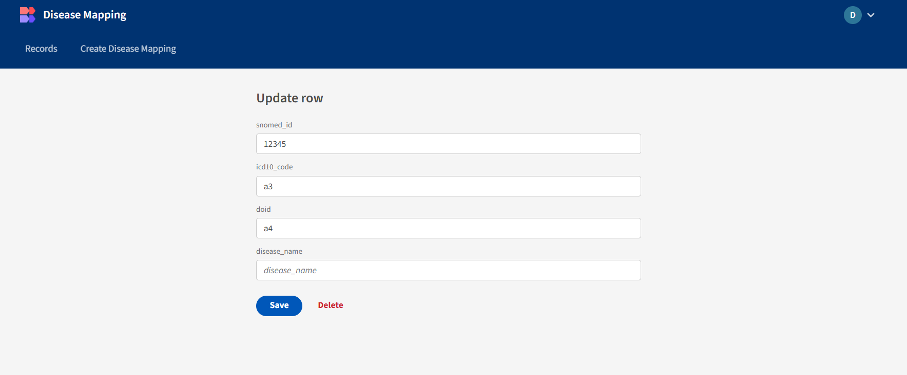

# 🦠 Disease Mapping Budibase App

A containerized CRUD web application built with **Budibase**, designed to manage disease mapping records using standardized identifiers such as SNOMED CT, ICD-10, and DOID.  
This project demonstrates proficiency in Docker, Docker Compose, and low-code platforms for rapid internal tool development.

---

## 📌 Project Description & Purpose

This application allows users to **Create, Read, Update, and Delete** disease mapping records with the following fields:

- `snomed_id`: SNOMED CT identifier
- `icd10_code`: ICD-10 code
- `doid`: Disease Ontology ID
- `disease_name`: Optional descriptive name
- `created_at`: Timestamp of creation
- `updated_at`: Timestamp of last update

**Purpose**:
- Demonstrate container orchestration with Docker
- Build and deploy a low-code application using Budibase
- Provide a clean and functional user interface for data management

---

## 🧰 Prerequisites

Make sure the following are installed:

Docker ≥ 20.10  
Docker Compose ≥ 1.29
Git ≥ 2.30

---

## 🚀 Setup Instructions

1. **Clone the Repository**:
   ```bash
   git clone https://github.com/D-Robot-M/disease-mapping-budibase.git
   cd disease-mapping-budibase
2. **Create .env file**:
Copy to `.env` and fill in your secrets
JWT_SECRET=your_jwt_secret
ENCRYPTION_SECRET=your_encryption_secret
COUCH_DB_PASSWORD=your_couch_password
2. **Start the application**:
   ```bash
   docker-compose up -d

## 🧩 Import Budibase App

1. Go to [http://localhost:10000](http://localhost:10000)
2. Click "Apps" > "Import App"
3. Upload `budibase-exports/disease-mapping-app.tar`

## 🖼️ Screenshots

### 📝 List View


### ➕ Create Form


### ✏️ Edit Form
